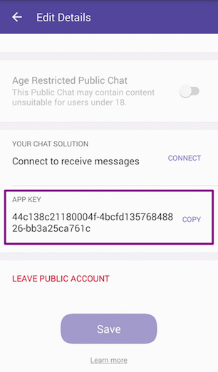

# How to create you first Viber bot


## Early access to public account

If you already can create special account (you have early access) - skip this step. In order to get early access you need:

1. Visit [https://www.viber.com/en/public-accounts](https://www.viber.com/en/public-accounts)

2. Click **Apply for a Public Account** button

3. Fill form and send it

Soon you will receive a message like this:


After this - restart Viber app, and go to next step.


## Create public account (page)

Now you can create **Viber Public Account** (PA) from you Viber app:

1. Open Public Accounts through the Public Accounts icon  at the top right of your screen

2. Once you're on the Public Accounts home page, tap on the create button  at the bottom of the screen

3. Tap on Join now to start creating your Public Account

4. Fill you application info (name, category, background photo etc.)

5. On finish step you can copy api-token, or you can get token on "Edit details" page



That's all.

## Install this package with composer

You can download it from github or install with composer (recommended):
```
composer require bogdaan/viber-bot-php
```

## Setup webhook

First you need trusted CA certificate webhook url (you can get [letsencryptp](https://letsencrypt.org) cert for dev server).

Let's create setup.php and subscrive for viber events:
```
<?php
require_once("vendor/autoload.php");

use Viber\Client;

$apiKey = '<PLACE-YOU-API-KEY-HERE>'; // from "Edit Details" page
$webhookUrl = '<PLACE-YOU-HTTPS-URL>'; // for exmaple https://my.com/bot.php

try {
    $client = new Client([ 'token' => $apiKey ]);
    $result = $client->setWebhook($webhookUrl);
    echo "Success!\n";
} catch (Exception $e) {
    echo "Error: ". $e->getError() ."\n";
}
```

## Create bot

We already subscribed for events. Now we can can accept messages, pictures and other events. Let's create simple bot.php:

```
<?php

require_once("vendor/autoload.php");

use Viber\Bot;

$apiKey = '<PLACE-YOU-API-KEY-HERE>';

$botSender = new Sender([
    'name' => 'Reply bot',
    'avatar' => 'https://developers.viber.com/img/favicon.ico',
]);

try {
    $bot = new Bot([ 'token' => $apiKey ]);
    $bot
    ->onText('|.*|s', function ($event) use ($bot) {
        // .* - match any symbols (see PCRE)
        $bot->getClient()->sendMessage(
            (new \Viber\Api\Message\Text())
            ->setSender($botSender)
            ->setReceiver($event->getSender()->getId())
            ->setText("Hi!")
        );
    })
    ->run();
} catch (Exception $e) {
    // todo - log errors
}

```

You can see more in **examples** directory.

## Resources

- [Official documentation](https://developers.viber.com/docs/api/rest-bot-api/)
